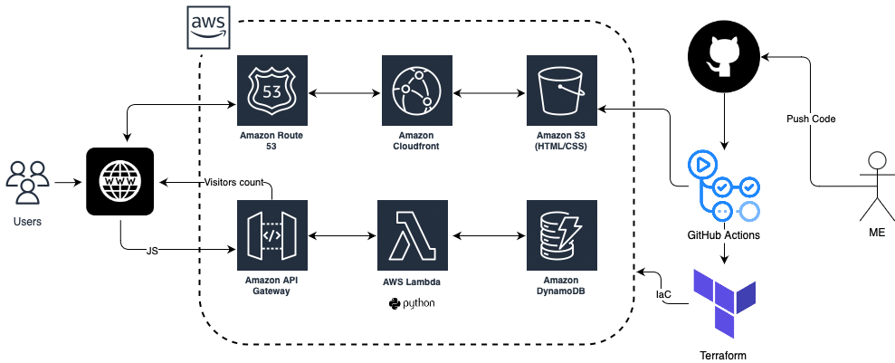
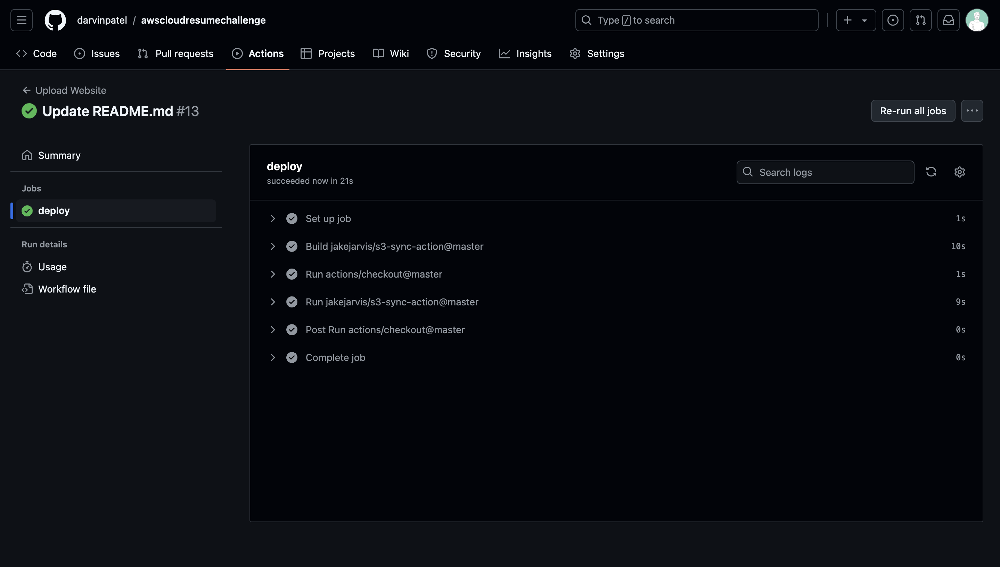
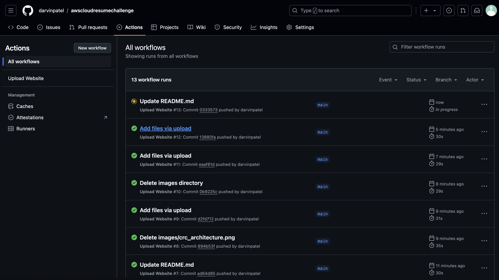

# AWS Cloud Resume Challenge

## Overview

This project is my submission for the AWS Cloud Resume Challenge, a hands-on learning experience to showcase proficiency in Amazon Web Services (AWS) by building a resume-styled website hosted entirely on AWS serverless infrastructure.

## Technologies Used

- **AWS Services:**
  - Route53
  - CloudFront
  - Certificate Manager
  - Amazon S3
  - API Gateway
  - AWS Lambda
  - DynamoDB
  - IAM

- **Tools & Frameworks:**
  - git
  - HTML, CSS, JavaScript
  - HashiCorp Terraform
  - Github Actions
 

## Project Structure

- **`/frontnend`**: Contains the source code for the resume website.
- **`/infra`**: Holds the Terraform modules created and used to define the AWS infrastructure.
- **`.github/workflows/front-end-cicd.yml`**: The Github Actions CI configuration for deployment
- **`/images`**: Screenshot for this README depicting the architecture

## Architecture 

> Building my full-stack resume on AWS

This blog is about how I build my resume as website entirely on AWS. This is a challenge created by [Forrest Brazeal](https://twitter.com/forrestbrazeal), Which helped many peoples who wants to step into Cloud technology but doesn't have experience. 

Visit the official [Cloud Resume Challenge](https://cloudresumechallenge.dev) homepage for more information

## Lets Start the challenge

### 1. HTML/CSS 
Wrote my resume as HTML webpage and used CSS for styling. To be honest I already have a portfolio website so for the sake of the challenge I took a template from internet and modified it. 

### 2. CI/CD Frontend
Once the HTML code's are ready I decided to implement CI/DC for frontend. I felt this is the most easy part of this challenge.
I used GitHub Actions for my CI/CD pipeline. Once I pushed my codes to GitHub repo, GitHub Actions will be triggered which will sync all my code to a S3 bucket and make it public to access as Static website.

### 3. Domain Registration 
Registered my sub-domain at namecheap.com 

### 4. Make website functional
Now comes the interesting part. We have our static website and a registered domain. Lets make it work together.

Create a Hosted Zone entry on Route 53 and add records

Create a Cloudfront distribution which will make the website available from all edge location 

One another requirement is our website should always redirect to HTTPS, to make this possible we need to create a certificate on AWS Certificates Manager and connect it to CloudFront. Make sure to have the CloudFront to always redirect to HTTPS.

Voila 💪🏼  our website is online 

### 5. Backend configuration

We are halfway through. Now lets build the backend. Backend consists of **API Gateway**, **Lambda** and **DynamoDB** to store and retrieve visitors count. 
I started with DynamoDB. I created a table which stores Visitors count, its a simple table with one record. 

Next I created a Lambda function using Python to query DynamoDB to get the Visitors count. This same Lambda function would update the visitors count every time the website was accessed. 

### 6. Infrastructure as a Code (IaC)

This is the fun part which I loved to do in this project. Even though the challenge was to use SAM as IaC I decided to use Terraform since am familiar with it. I build the entire stack with Terraform 💯, never configured any of the AWS service via GUI. This helps me understand TF a lot more. 

### 7. CI/CD Pipeline

I went with GitHub actions to automate my workflow. 

Front-end Actions will checkout the HTML/CSS codes and sync to S3 bucket

Back-end Actions consist of two GitHub Actions workflow 
- Terraform Plan
- Terraform Apply

I configured Terraform Apply job in a such a way that it will trigger only if the code is merged from FeatureBranch to Main branch. 

### 8. Visitor Count

Finally lets play with adding Visitors count to the website.

In this part we need to have a JavaScript on our website which will call the API Gateway, API will trigger the Lambda function which will update the count on DynamoDB and in return GET the visitors count and pass it to the webpage.
This is another tough part for me since JavaScripting is brand new for me.

## Finally!!!

At the end we now have our resume hosted on AWS and its available for the world to access anytime, also we can know how many peoples visited our site 😎

I'm happy that I have completed this challenge as expected. I was able to put all my AWS and Terraform knowledge on this project and am glade to learn something new. 
Eager to do more challenges like this.

Please checkout [my website](https://awsresume.darvinpatel.com/)
